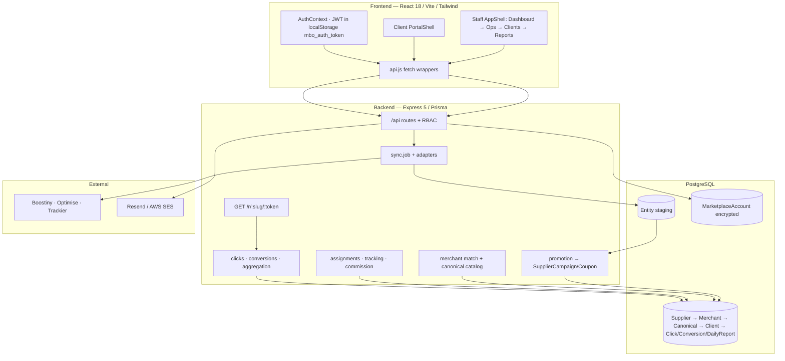

# MBO Integrated Platform — Complete Knowledge Transfer

> **Product name:** MBO Rewards  
> **Repository:** `git@github.com:avantikanautiyal/MBOIntegratedPlatform.git`  
> **Last updated:** August 2026  
> **Audience:** Engineers onboarding, taking over ownership, or explaining the platform end-to-end

This document is the single source of truth for **what the platform is**, **how every page works**, **how data flows and maps**, and **how systems connect**. Companion deep-dives live under `docs/` (domain model, wave architecture, ops).

---

## Table of Contents

1. [Executive Summary & Business Model](#1-executive-summary--business-model)
2. [High-Level Architecture](#2-high-level-architecture)
3. [Repository Structure](#3-repository-structure)
4. [Technology Stack](#4-technology-stack)
5. [End-to-End Data Pipeline (The Mapping Spine)](#5-end-to-end-data-pipeline-the-mapping-spine)
6. [Authentication, Roles & Permissions](#6-authentication-roles--permissions)
7. [Page-by-Page Functionality (Staff)](#7-page-by-page-functionality-staff)
8. [Page-by-Page Functionality (Client Portal)](#8-page-by-page-functionality-client-portal)
9. [Public / Unauthenticated Surfaces](#9-public--unauthenticated-surfaces)
10. [Client Onboarding Wizard (Deep Dive)](#10-client-onboarding-wizard-deep-dive)
11. [Tracking Redirect & Attribution](#11-tracking-redirect--attribution)
12. [Database Schema Summary](#12-database-schema-summary)
13. [API Reference](#13-api-reference)
14. [Frontend API Client & App Shell](#14-frontend-api-client--app-shell)
15. [Integrations & Sync Engine](#15-integrations--sync-engine)
16. [Environment Variables](#16-environment-variables)
17. [Local Development Setup](#17-local-development-setup)
18. [Deployment & Operations](#18-deployment--operations)
19. [Key File Reference](#19-key-file-reference)
20. [Known Gaps & Gotchas](#20-known-gaps--gotchas)

---

## 1. Executive Summary & Business Model

**MBO Rewards is not an HR “Management by Objectives” system.** It is an **affiliate operations aggregator**.

MBO connects to multiple affiliate **Suppliers** (Boostiny, Optimise SEA/MENA/UK, Trackier; Partnerize planned) as a publisher, ingests campaigns/coupons/performance/conversions, **canonicalises** that data into one brand/campaign catalog, then **re-distributes** selected offers to **Clients** (sub-publishers / media partners).

### How MBO makes money

| Concept | Meaning |
|---------|---------|
| **Gross commission** | What the supplier pays MBO for a conversion |
| **Client commission** | What MBO pays/credits the client (share %) |
| **MBO margin** | `gross − client` |

Commercial models on a client:

| Model | Behavior |
|-------|----------|
| `OFFERS_ONLY` | Client gets offers/tracking; `clientSharePercent = 0` (MBO keeps 100%) |
| `OFFERS_PLUS_COMMISSION` | Client gets a configured % of approved supplier commission (UI default often 70%) |

### Three ownership worlds (never blur these)

| World | Owns truth about | Examples |
|-------|------------------|----------|
| **Supplier** | What the network offers and pays MBO | Supplier campaign facts, coupon codes, gross commission, raw conversions |
| **MBO** | Curation, distribution, pricing | Merchant identity, canonical campaign, assignments, tracking links, client commission, published status |
| **Client** | Own demand / profile | Brand requests, bank details, support tickets, limited org settings |
| **System** | Machine facts & lineage | IDs, timestamps, clicks, daily report aggregates |

**Golden rule:** A field’s owner is whoever may change its meaning. Supplier data is read-only to MBO ops. MBO decisions are read-only to clients. Clients create requests and manage limited self-service data.

### Supported supplier platforms

| Platform key (API/UI) | Provider | Auth |
|-----------------------|----------|------|
| `boostiny` | Boostiny Publisher API | API key / OAuth |
| `optimise_sea` | Optimise Media (Agency 118) | API key + agency/contact IDs / OAuth |
| `optimise_mena` | Optimise Media (Agency 172) | Same |
| `optimise_uk` | Optimise Media (Agency 1) | Same |
| `trackier` | Trackier / vCommission | API key (`X-Api-Key`) |

DB `SupplierKey` enum: `BOOSTINY` | `OPTIMISE` | `TRACKIER` | `PARTNERIZE` | `UNKNOWN`.

---

## 2. High-Level Architecture



| Layer | Responsibility |
|-------|----------------|
| Frontend SPA | Role-gated UI; JWT auth; calls `/api/*` |
| Express API | Auth, RBAC, domain services, jobs triggers |
| Prisma / Postgres | System of record |
| Redis (optional) | Cache / ops when `REDIS_URL` set |
| Nginx (compose) | Reverse proxy for `/api`, `/health`, `/metrics` |
| Public redirect | `/r/{slug}/{token}` records click then 302 to supplier URL |

---

## 3. Repository Structure

Two sibling apps (not a package-manager monorepo):

```
MBO Integrated Platform/
├── KNOWLEDGE_TRANSFER.md
├── docs/                         # Wave architecture, domain model, ops
├── deploy/nginx.conf
├── docker-compose.yml            # Postgres 16, Redis 7, API, Nginx
├── load-tests/
├── .github/workflows/ci.yml
├── backend/
│   ├── prisma/schema.prisma
│   ├── scripts/                  # sync CLI, diagnostics
│   └── src/
│       ├── adapters/             # boostiny, optimise, trackier
│       ├── auth/permissions.js
│       ├── controllers/
│       ├── jobs/                 # sync, promotion, aggregation
│       ├── middleware/auth.js
│       ├── modules/              # auth, supplier, merchant, catalog, client, commercial, reporting, coupons
│       ├── platform/             # health, metrics, redis, ops, security, OpenAPI
│       ├── routes/index.js
│       ├── app.js
│       └── index.js
└── frontend/
    └── src/
        ├── api.js
        ├── auth/permissions.js
        ├── config/navigation.js
        ├── context/AuthContext.jsx
        ├── routes/AppRoutes.jsx
        ├── components/           # ProtectedRoute, AppShell, PortalShell, UI
        ├── pages/                # All screens
        └── legacy/               # Entity explorer / integrations legacy embeds
```

---

## 4. Technology Stack

| Layer | Stack |
|-------|--------|
| Frontend | React 18, React Router 7, Vite 5, Tailwind 3 |
| Backend | Node ESM, Express 5, Zod, Pino, Helmet, rate-limit, Swagger/OpenAPI |
| DB | PostgreSQL via Prisma |
| Cache / ops | Redis (optional), Prometheus `/metrics` |
| Auth | JWT (`jsonwebtoken`) + bcrypt; partner API keys `mbo_live_*` |
| Email | Resend and/or AWS SES (OTP / invites) |
| Deploy | Docker Compose; frontend often Vercel; API commonly Railway |

---

## 5. End-to-End Data Pipeline (The Mapping Spine)

This is the **canonical mapping** of how inventory becomes money:

```
MarketplaceAccount  (+ adapters)
        ↓ sync job
Entity  (entityType: campaign | performance | payment | conversion | coupon | …)
        ↓ promotion (/promotion/run or AUTO_PROMOTE_AFTER_SYNC)
SupplierCampaign  +  SupplierCoupon
        ↓ merchant matching / MerchantReview
Merchant  (+ MerchantAlias)
        ↓ catalog promote / attach
CanonicalCampaign  ←→  CampaignSource  (→ SupplierCampaign)
        ↓ client onboarding allot OR assignments APIs
Client  →  ClientCampaignAssignment
        ↓ commercial artifacts
TrackingLink  +  ClientCouponAssignment  +  ClientCommissionRule
        ↓ public GET /r/:slug/:token
Click
        ↓ supplier conversion sync / POST /conversions
Conversion  (status + attributionStatus + commission split)
        ↓ aggregation (/aggregation/run)
DailyReport  (day × client × merchant × canonicalCampaign)
```

### What each hop means

| Hop | What happens | Who triggers |
|-----|--------------|--------------|
| Sync | Pull supplier APIs → upsert `Entity` + `FieldRegistry` paths | Integrations UI, scheduler, CLI |
| Promote (“Ad Promo”) | Map entities → typed `SupplierCampaign` / `SupplierCoupon` | Promotion page / auto after sync |
| Merchant match | Link campaigns to brand identity; ambiguous → `MerchantReview` | Jobs / `/merchant-matching/run` |
| Catalog | Create/update `CanonicalCampaign` + `CampaignSource` | Catalog APIs / allotment side-effects |
| Allot / assign | Bind client ↔ campaign; create tracking, coupon assign, commission | Client wizard / Assignments |
| Click | Public short link → `Click` row → 302 supplier | End users |
| Conversion | Ingest/sync conversion; split commission | Sync + attribution |
| Aggregate | Roll up into `DailyReport` | Aggregation job |

### Visibility & status enums that matter in UI

| Area | Values |
|------|--------|
| `ClientStatus` | `PROSPECT` → `ACTIVE` → `SUSPENDED` → `OFFBOARDED` |
| `AssignmentStatus` | `ASSIGNED` (Draft), `ACTIVE`, `PAUSED`, `REVOKED` (+ `published` flag / Live) |
| `TrackingLinkStatus` | `GENERATED` \| `ACTIVE` \| `REVOKED` |
| `CommissionRuleStatus` | `DRAFT` \| `EFFECTIVE` \| `SUPERSEDED` |
| `CatalogVisibility` | `INTERNAL` \| `ASSIGNABLE` \| `HIDDEN` |
| `CanonicalCampaignStatus` | `DRAFT` \| `PUBLISHED` \| `PAUSED` \| `ARCHIVED` |
| `ConversionStatus` | `PENDING` \| `APPROVED` \| `REJECTED` \| `PAID` \| `UNKNOWN` |
| `AttributionStatus` | `PENDING` \| `ATTRIBUTED` \| `ORPHAN` \| `REATTRIBUTED` |
| Brand request | `REQUESTED` → `UNDER_REVIEW` → `APPROVED`/`REJECTED` → `FULFILLED` |

---

## 6. Authentication, Roles & Permissions

### Auth flows

| Flow | Steps | Endpoints |
|------|-------|-----------|
| **Login** | Email/password → JWT | `POST /api/auth/login` |
| **Signup** | Send OTP → verify → register | `POST /auth/send-otp`, `/verify-otp`, `/register` |
| **Bootstrap** | Load current user | `GET /auth/me` |
| **Invite (portal)** | Token page → set password | `GET /auth/invite/:token`, `POST /auth/set-password` |
| **Logout** | Clear server session marker + local token | `POST /auth/logout` |

- JWT signed with `JWT_SECRET`, expiry **7 days**. Payload: `sub`, `email`, `role`, `clientId`.
- **Permissions are not stored in the JWT**; they are recomputed from role on every request (`getPermissionsForRole`).
- Frontend stores token in `localStorage` key `mbo_auth_token` (`AuthContext.jsx`).
- First self-signup user becomes **ADMIN**; later self-signups become **SUPPORT** (staff invite/create for other roles).

### Partner / portal auth (`authenticatePartner`)

Accepted as:

1. Header `X-Api-Key` or Bearer token starting with `mbo_live_*`, **or**
2. JWT with `role === CLIENT` and linked `Client.status === ACTIVE`

Sets `req.partnerClientId`. Clients **never** pass their own `clientId` — tenancy is forced from the credential.

### Roles

| Role | Intended job | Access summary |
|------|--------------|----------------|
| **ADMIN** | Platform owner | All permissions including users, ops, integrations, coupon columns |
| **OPERATIONS** | Day-to-day ops | Clients, catalog, merchants, tracking, coupons write, commission — **no** user admin / integrations manage / ops telemetry |
| **ANALYST** | Reporting | Read campaigns, performance, conversions, clients, tracking, coupons |
| **TECH** | Integrations eng | Integrations, sync trigger, logs, system read, campaigns read |
| **SUPPORT** | Light support | `campaigns:read`, `coupons:read` only |
| **CLIENT** | External partner | Portal permissions only; forced onto `/portal` |

There is **no** separate “manager” or “employee” role — map those concepts to OPERATIONS / ANALYST / TECH / SUPPORT.

### Permission catalog

Defined in `backend/src/auth/permissions.js` (mirrored in `frontend/src/auth/permissions.js`):

`campaigns:read`, `performance:read`, `payments:read`, `conversions:read`, `commission:read`, `export:data`, `integrations:read`, `integrations:manage`, `sync:trigger`, `users:manage`, `logs:read`, `system:read`, `coupons:read`, `coupons:write`, `coupon_columns:manage`, `merchants:read`, `merchants:manage`, `catalog:read`, `catalog:manage`, `clients:read`, `clients:manage`, `tracking:read`, `tracking:manage`, `coupon:read`, `coupon:manage`, `commission:manage`, `ops:read`, plus portal: `portal:campaigns:read`, `portal:performance:read`, `portal:payments:read`, `portal:payments:manage`, `portal:settings:read`, `portal:support`.

Entity browser tabs further map `?type=` → `ENTITY_TYPE_PERMISSIONS` (campaign/performance/payment/conversion/coupon).

### Shell routing rules (`ProtectedRoute` + `AppShell`)

1. Unauthenticated → `/login`.
2. **CLIENT** may only use `/portal/*` and `/profile`; anything else redirects to `/portal`.
3. Missing permission → CLIENT → `/portal`, staff → `/`.
4. CLIENT gets **PortalShell**; staff get **AppShell** (sidebar from `NAV_SECTIONS`). Staff never see portal nav; clients never see staff nav.

---

## 7. Page-by-Page Functionality (Staff)

Router source of truth: `frontend/src/routes/AppRoutes.jsx`.  
Nav source of truth: `frontend/src/config/navigation.js`.

### Role → page cheat sheet

| Page | ADMIN | OPS | ANALYST | TECH | SUPPORT | CLIENT |
|------|:-----:|:---:|:-------:|:----:|:-------:|:------:|
| Executive Dashboard `/` | ✓ | ✓ | ✓ | ✓ | ✓ | → portal |
| Suppliers / Entity Explorer | ✓ | ✓ | ✓ | ✓ | ✓ | — |
| Ad Promo / Sync UI | ✓ | — | — | ✓ | — | — |
| Clients / Assignments | ✓ | ✓ | read | — | — | — |
| Tracking / Reports / Clicks / Conversions | ✓ | ✓ | ✓* | — | — | — |
| Integrations / Access Logs | ✓ | — | — | ✓ | — | — |
| Coupon CMS | ✓ | ✓ | — | — | — | — |
| Users | ✓ | — | — | — | — | — |
| Portal | — | — | — | — | — | ✓ |

\*Analyst lacks payments write and commission manage.

---

### 7.1 Login — `/login`

| | |
|--|--|
| **File** | `frontend/src/pages/LoginPage.jsx` |
| **Access** | Public |
| **Purpose** | Sign in to staff dashboard or client portal. |
| **What user does** | Enter email/password → Sign In; link to signup. |
| **How it works** | `AuthContext.login` → `POST /api/auth/login` → store JWT → CLIENT navigates to `/portal`, else `state.from` or `/`. |
| **Mapping** | UI credentials → `User.email` / `User.passwordHash`; response includes `role` + computed `permissions[]`. |

---

### 7.2 Signup — `/signup`

| | |
|--|--|
| **File** | `frontend/src/pages/SignupPage.jsx` |
| **Access** | Public (rate-limited) |
| **Purpose** | OTP-verified account creation. |
| **What user does** | Enter email → Send/Resend OTP → enter 6-digit code (auto-verify) → set password → Create Account. |
| **How it works** | `POST /auth/send-otp` → email via Resend/SES → `POST /auth/verify-otp` → `verificationToken` → `POST /auth/register`. |
| **Mapping** | OTP rows → `EmailOtp`; user → `User` (`ADMIN` if first user else `SUPPORT`). |

---

### 7.3 Set Password — `/set-password?token=…`

| | |
|--|--|
| **File** | `frontend/src/pages/SetPasswordPage.jsx` |
| **Access** | Public |
| **Purpose** | Complete portal invite for a CLIENT user. |
| **What user does** | Land with invite token → set password → redirect `/login`. |
| **How it works** | `GET /auth/invite/:token` shows email/client; `POST /auth/set-password` `{ token, password }`. |
| **Mapping** | Token → `User.inviteTokenHash` / `inviteExpiresAt`; clears invite fields on success. |

---

### 7.4 Profile — `/profile`

| | |
|--|--|
| **File** | `frontend/src/pages/ProfilePage.jsx` |
| **Access** | Any authenticated user (including CLIENT) |
| **Purpose** | Read-only identity card. |
| **What user does** | View name, email, role (no mutations). |
| **How it works** | Reads `useAuth().user` from `/auth/me`. |

---

### 7.5 Executive Dashboard — `/`

| | |
|--|--|
| **File** | `frontend/src/pages/dashboard/ExecutiveDashboardPage.jsx` |
| **Access** | Staff only (`staffOnly` nav; CLIENT redirected) |
| **Purpose** | Single-pane KPI overview of platform health and commercial totals. |
| **What user does** | View cards/charts; retry on error. No mutations. |
| **How it works** | Parallel fetches: |
| | `GET /clients?pageSize=1` → client count |
| | `GET /entities?type=campaign` → campaign inventory count |
| | `GET /suppliers` → supplier list |
| | `GET /conversions` → conversion totals |
| | All pages of `GET /entities?type=performance` → click time series |
| | Optional `GET /logs/access` (needs `logs:read`) |
| | Optional `GET /ops/metrics` (needs `ops:read`, ADMIN) |
| | `GET /reports/daily` → commission KPIs when permitted |
| **Mapping** | Gross/Client/MBO ← `DailyReport.grossCommission` / `clientCommission` / `mboCommission`; clicks ← `Entity.normalizedData.clicks` + event dates. |

---

### 7.6 Suppliers — `/suppliers`

| | |
|--|--|
| **File** | `frontend/src/pages/suppliers/SuppliersPage.jsx` |
| **Permission** | `campaigns:read` |
| **Purpose** | Show configured affiliate network suppliers (reference objects). |
| **What user does** | Refresh and inspect supplier rows. |
| **How it works** | `GET /api/suppliers` → table. |
| **Mapping** | Display name / key / status → `Supplier.displayName`, `Supplier.key`, `Supplier.status` (`PLANNED` \| `ENABLED` \| `DEPRECATED`). |

---

### 7.7 Ad Promo (Promotion) — `/promotion`

| | |
|--|--|
| **File** | `frontend/src/pages/suppliers/PromotionPage.jsx` |
| **Permission** | `sync:trigger` (ADMIN, TECH) |
| **Purpose** | Promote raw synced `Entity` rows into business objects `SupplierCampaign` / `SupplierCoupon`. |
| **What user does** | Optionally filter `networkSource`, entity IDs, batch size; toggle Campaigns/Coupons; **Run Ad Promo**; inspect JSON summary. |
| **How it works** | `POST /api/promotion/run` with `{ entityTypes, networkSource?, entityIds?, batchSize? }`. Related: `/promotion/retry`, `/mapper-errors`. |
| **Mapping** | `Entity` (campaign/coupon) → mapper → `SupplierCampaign` / `SupplierCoupon`; failures → `MapperError`. |
| **Backend** | `modules/supplier/services/promotion.service.js` |

---

### 7.8 Entity Explorer — `/data/entities`

| | |
|--|--|
| **File** | `frontend/src/pages/data/EntityExplorerPage.jsx` (embeds legacy dashboard) |
| **Permission** | Route: `campaigns:read`; **tabs** further gated by entity-type perms |
| **Purpose** | Browse raw staging inventory exactly as synced — the landing zone before promotion. |
| **What user does** | Switch tabs (campaign / performance / payment / conversion / coupon); filter network, account, brand, dates, search; paginate; export; inspect dynamic columns from field registry. |
| **How it works** | `GET /entities?type=…`, `GET /entities/summary`, `GET /fields?entity_type=…`, coupon columns `GET /coupons/columns`, optional `GET /marketplace/accounts`. |
| **Mapping** | Unique key `(externalId, networkSource, entityType)` on `Entity`; cells from `normalizedData` / `rawData` / `FieldRegistry` / `CouponColumnConfig`. |

---

### 7.9 Clients — `/clients`

| | |
|--|--|
| **File** | `frontend/src/pages/clients/ClientsPage.jsx` (+ `ClientSetupWizard.jsx`) |
| **Permission** | `clients:read` (manage actions need `clients:manage`) |
| **Purpose** | CRUD client organisations and drive full onboarding. |
| **What user does** | Search/filter by status; Create Client; open **Setup** wizard; ActionMenu: Set Active, Continue onboarding, jump to allotment, Provision & activate, Suspend, Offboard, Delete. |
| **How it works** | `GET/POST/PATCH/DELETE /api/clients`. Wizard APIs documented in [§10](#10-client-onboarding-wizard-deep-dive). |
| **Mapping** | Form → `Client` fields (`name`, `slug`, `industry`, `category`, `subCategory`, `country`, `currency`, `timezone`, `status`, `commercialModel`, `clientSharePercent`). Setup progress ← onboarding checklist. |

---

### 7.10 Assignments — `/assignments`

| | |
|--|--|
| **File** | `frontend/src/pages/clients/AssignmentsPage.jsx` |
| **Permission** | `clients:read` (mutations: `clients:manage`) |
| **Purpose** | Lifecycle management of which campaigns are allotted to which clients. |
| **What user does** | Filter by status; **Publish** / **Pause** / **Archive**; view commission overlay. |
| **How it works** | `GET /client-assignments`; `PATCH /client-assignments/:id` with lifecycle (`published` / `paused` / `archived`); commission via `GET /commission-rules`. |
| **Mapping** | Row → `ClientCampaignAssignment` + nested `Client`, `CanonicalCampaign`; Live = `published && status === ACTIVE`. |

---

### 7.11 Tracking Links — `/tracking-links`

| | |
|--|--|
| **File** | `frontend/src/pages/commercial/TrackingLinksPage.jsx` |
| **Permission** | `tracking:read` (mutations: `tracking:manage`) |
| **Purpose** | Inspect and manage MBO short links used for attribution. |
| **What user does** | Filter by search/client/status; Copy MBO URL; Preview redirect; Open supplier URL; Make primary; Regenerate token; Disable (revoke). |
| **How it works** | `GET /tracking-links`; `PATCH /tracking-links/:id` with `{ isPrimary }`, `{ regenerateToken: true }`, or `{ status: "REVOKED" }`. |
| **Mapping** | Public URL pattern `/r/{slug}/{token}` where token = `TrackingLink.subId`; destination = supplier tracking URL; clicks ← `clickCount`. |

---

### 7.12 Commission Rules (component / unrouted page)

| | |
|--|--|
| **File** | `frontend/src/pages/commercial/CommissionRulesPage.jsx` (**not** in `AppRoutes`; also surfaced via `CouponCommissionPanel` on Coupon CMS) |
| **Permission** | `commission:read` / `commission:manage` |
| **Purpose** | Define gross vs client vs MBO split per assignment. |
| **What user does** | Create rule; Activate (`DRAFT`→`EFFECTIVE`); Supersede. |
| **How it works** | `GET/POST /commission-rules`; `PATCH` with `{ activate }` / `{ supersede }`. |
| **Mapping** | Entered gross/client; MBO derived = gross − client → `ClientCommissionRule`. Types: `PERCENT` \| `FIXED` \| `TIERED` \| `UNKNOWN`. |

---

### 7.13 Client Reports — `/reports/clients`

| | |
|--|--|
| **File** | `frontend/src/pages/reporting/ClientReportsPage.jsx` |
| **Permission** | `performance:read` |
| **Purpose** | Aggregated performance by client. |
| **What user does** | Date range filter; paginate/refresh. |
| **How it works** | `GET /reports/client?fromDate&toDate`. |
| **Mapping** | Dimensions from `DailyReport` rolled by client: clicks, conversions, conversion rate, EPC, commissions (when permitted). |

---

### 7.14 Campaign Reports — `/reports/campaigns`

| | |
|--|--|
| **File** | `frontend/src/pages/reporting/CampaignReportsPage.jsx` |
| **Permission** | `performance:read` |
| **Purpose** | Aggregated performance by campaign. |
| **How it works** | `GET /reports/campaign` — same metrics, `dimensionId` = campaign. |

---

### 7.15 Clicks — `/clicks`

| | |
|--|--|
| **File** | `frontend/src/pages/reporting/ClicksPage.jsx` |
| **Permission** | `tracking:read` |
| **Purpose** | Raw click log from MBO redirector. |
| **What user does** | Search `subId`; filter country; paginate. |
| **How it works** | `GET /clicks`. |
| **Mapping** | → `Click` (`subId`, `trackingLinkId`, `country`, `device`, `clickedAt`). `DeviceType`: `DESKTOP` \| `MOBILE` \| `TABLET` \| `APP` \| `OTHER` \| `UNKNOWN`. |

---

### 7.16 Conversions — `/conversions`

| | |
|--|--|
| **File** | `frontend/src/pages/reporting/ConversionsPage.jsx` |
| **Permission** | `conversions:read` |
| **Purpose** | Attribution and commission outcomes. |
| **What user does** | Filter status (`pending`/`approved`/`rejected`) and supplier; paginate. |
| **How it works** | `GET /conversions`. Ingest path (jobs/tech): `POST /conversions`. |
| **Mapping** | → `Conversion`; gross often `approvedCommission ?? supplierCommission`; client/mbo columns when `commission:read`. |

---

### 7.17 Access Logs — `/platform/logs`

| | |
|--|--|
| **File** | `frontend/src/pages/platform/AccessLogsPage.jsx` |
| **Permission** | `logs:read` (ADMIN, TECH) |
| **Purpose** | Audit trail of sensitive staff actions. |
| **How it works** | `GET /logs/access`. Middleware `auditAction(...)` writes on successful mutating routes. |
| **Mapping** | → `AccessLog` (`action`, `user`, `resource`, `ipAddress`, `createdAt`). |

---

### 7.18 Integrations — `/integrations`

| | |
|--|--|
| **File** | `frontend/src/pages/platform/IntegrationsPage.jsx` (legacy Integration UI) |
| **Permission** | `integrations:read` (connect/disconnect: `integrations:manage`; sync: `sync:trigger`) |
| **Purpose** | Connect supplier credentials and run syncs. |
| **What user does** | Enter API key (+ Optimise agency/contact IDs, account label); Connect; Sync account / Sync all; Disconnect; watch sync status. |
| **How it works** | `GET /marketplace/accounts`; `POST /marketplace/accounts/:platform/connect`; `DELETE …/:accountLabel`; `POST /sync/all` or `/sync/:platform/:accountLabel`; poll `GET /sync/status`. OAuth: `/auth/connect/:platform` + callback. |
| **Mapping** | → `MarketplaceAccount` (tokens encrypted AES-256-GCM with `OAUTH_TOKEN_ENCRYPTION_KEY`). Credentials are **not** env vars — UI only. |

---

### 7.19 Coupon CMS — `/admin/coupons`

| | |
|--|--|
| **File** | `frontend/src/pages/AdminCouponsPage.jsx` |
| **Permission** | `coupons:write` (columns tab: `coupon_columns:manage`) |
| **Purpose** | Operational coupon inventory, column configuration, and commercial panel. |
| **What user does** | Filter/search; create/edit/delete coupons; manage column definitions (add/reorder/visibility/reset); open commission panel when permitted. |
| **How it works** | CRUD `/admin/coupons`; commercial `GET …/:id/commercial`; columns CRUD `/admin/coupons/columns`; commission via `/commission-rules`. |
| **Mapping** | Coupon CMS overlays + `Entity` coupon rows + `CouponColumnConfig`. Allotment wizard reads allottable coupons from this inventory. |

---

### 7.20 Users — `/users`

| | |
|--|--|
| **File** | `frontend/src/pages/UsersPage.jsx` |
| **Permission** | `users:manage` (ADMIN only) |
| **Purpose** | Staff/user administration. |
| **What user does** | Create user (name/email/password/role); change role; activate/deactivate; view recent access logs. |
| **How it works** | `GET/POST /users`, `PATCH /users/:id`, `GET /logs/access`. |
| **Mapping** | → `User`; roles creatable: `ADMIN`, `OPERATIONS`, `ANALYST`, `TECH`, `SUPPORT`, `CLIENT`. |

---

### Redirects (legacy paths)

| From | To |
|------|----|
| `/dashboard` | `/` |
| `/dashboard/integrations` | `/integrations` |
| `/admin/users` | `/users` |
| `*` (unmatched) | `/login` |

---

## 8. Page-by-Page Functionality (Client Portal)

All portal pages require CLIENT JWT (or partner API key on the same `/portal/v1` and `/partner/v1` APIs). Tenant is always derived from credential — never from query params.

Shell: `PortalShell` loads `GET /portal/v1/me`.

---

### 8.1 Portal Overview — `/portal`

| | |
|--|--|
| **File** | `frontend/src/pages/portal/PortalOverviewPage.jsx` |
| **Permission** | `portal:campaigns:read` |
| **Purpose** | Home: programme status, share %, KPIs, payment readiness. |
| **What user does** | View metrics; navigate to performance/payments. |
| **How it works** | `GET /portal/v1/overview`. |
| **Mapping** | Aggregates `Client`, assignments, reports, bank status (`ClientBankAccount`: `PENDING` \| `VERIFIED` \| `REJECTED`; UI may show `NOT_ADDED`). |

---

### 8.2 Assigned Campaigns — `/portal/campaigns`

| | |
|--|--|
| **File** | `frontend/src/pages/portal/PortalCampaignsPage.jsx` |
| **Permission** | `portal:campaigns:read` |
| **Purpose** | Client-facing catalog of allotted live offers. |
| **What user does** | Search; filter country/status (`Live`/`Paused`/`Expired`); Refresh; Export CSV; Copy tracking URL; open detail modal. |
| **How it works** | `GET /partner/v1/campaigns?pageSize=100`. |
| **Mapping** | `brand`, `name`, `offer`, `offerType`, `coupon.code`, `trackingUrl` (MBO link), `displayStatus`, `assignmentId`, `isNew` ← assignment + canonical + tracking. |

---

### 8.3 Performance — `/portal/performance`

| | |
|--|--|
| **File** | `frontend/src/pages/portal/PortalPerformancePage.jsx` |
| **Permission** | `portal:performance:read` (+ campaigns) |
| **Purpose** | Client’s own performance (order value, commissions, clicks). |
| **What user does** | Search/brand filter; Refresh; Export CSV; view detail. |
| **How it works** | `GET /portal/v1/performance`. KPIs summed client-side from response rows. |

---

### 8.4 Payments — `/portal/payments`

| | |
|--|--|
| **File** | `frontend/src/pages/portal/PortalPaymentsPage.jsx` |
| **Permission** | `portal:payments:read` (mutations: `portal:payments:manage`) |
| **Purpose** | Bank details, available balance, withdrawals. |
| **What user does** | Add/Edit bank; Request withdrawal (min amount enforced, ≤ available); confirm; view history. |
| **How it works** | `GET /portal/v1/payments`; `PUT /portal/v1/bank`; `POST /portal/v1/withdrawals` `{ amount }`. |
| **Mapping** | Bank → `ClientBankAccount` (account number encrypted); withdrawals → `ClientWithdrawal` (`REQUESTED` \| `PROCESSING` \| `PAID` \| `REJECTED` \| `CANCELLED`). |

---

### 8.5 Support — `/portal/support`

| | |
|--|--|
| **File** | `frontend/src/pages/portal/PortalSupportPage.jsx` |
| **Permission** | `portal:support` (+ campaigns) |
| **Purpose** | API keys, docs, support tickets, campaign requests. |
| **What user does** | Show/hide/copy API key; Rotate key; open API docs; create `SUPPORT_TICKET` or `CAMPAIGN_REQUEST`; copy support email. |
| **How it works** | `GET /portal/v1/api-keys`, `GET /portal/v1/api-docs`, `POST /portal/v1/support`, `POST /portal/v1/api-keys/rotate`. |
| **Mapping** | Keys → `ClientApiCredential` (`mbo_live_*`); tickets → `ClientSupportRequest` (`OPEN` \| `IN_PROGRESS` \| `RESOLVED` \| `CLOSED`). |

---

### 8.6 Team & Settings — `/portal/settings`

| | |
|--|--|
| **File** | `frontend/src/pages/portal/PortalSettingsPage.jsx` |
| **Permission** | `portal:settings:read` (+ campaigns) |
| **Purpose** | Organisation, team, security prefs, notifications. |
| **What user does** | Edit org name; view team (invite may be toast-only UX); toggle login alerts / notification prefs. |
| **How it works** | `GET/PATCH /portal/v1/settings` (team also via `/portal/v1/team`). |
| **Mapping** | Org → `Client`; prefs → `Client.portalPreferences`; team → `User` rows with `clientId`. |

---

## 9. Public / Unauthenticated Surfaces

| Surface | Path | Behavior |
|---------|------|----------|
| Login / Signup / Set password | `/login`, `/signup`, `/set-password` | See §7 |
| Health | `/health`, `/health/live`, `/health/ready`, `/api/health` | Liveness/readiness |
| Metrics | `/metrics` | Prometheus |
| OpenAPI | `/api/openapi.json` | API schema |
| Tracking redirect | `/r/:slug/:token` or `/r/:token` | Record click → 302 supplier (see §11) |

---

## 10. Client Onboarding Wizard (Deep Dive)

Opened from Clients page (not its own route). File: `frontend/src/pages/clients/ClientSetupWizard.jsx`. Requires `clients:manage`.

| Step | Label | User actions | APIs |
|------|-------|--------------|------|
| **1** | Client Organisation | Edit org fields; save | Load `GET /clients/:id/onboarding`. Save `PATCH /clients/:id` |
| **2** | Commercial Model | Choose `OFFERS_ONLY` or `OFFERS_PLUS_COMMISSION` (+ share %) | `PUT /clients/:id/onboarding/commercial-model` |
| **3** | Campaign Allotment | Filter allottable coupons; select; **Allot selected** (chunks of 40) | List `GET /admin/coupons` (`allottableOnly`, filters). Allot `POST /clients/:id/onboarding/allot` `{ couponEntityIds }` |
| **4** | Review | Read-only checklist | Uses onboarding payload |
| **5** | Provision & Activate | Provision; create API key; create portal login; Activate | `POST …/onboarding/provision`; `POST …/api-keys`; `POST …/portal-users`; `POST …/onboarding/activate` |

### Allotment side effects (critical mapping)

Selecting coupon entities and calling allot creates/updates as needed:

- `CanonicalCampaign` + `CampaignSource`
- `ClientCampaignAssignment`
- `TrackingLink`
- `ClientCouponAssignment`
- `ClientCommissionRule` (from commercial model / share %)

### Onboarding checklist flags

`clientCreated`, `commercialConfigured`, `administratorConfigured`, `campaignsAllotted`, `couponAssignmentsPrepared`, `commissionRulesPrepared`, `trackingLinksGenerated`, `assignmentsPublished`, `apiKeyIssued`, `provisioned`, `activated`.

Backend owner: `clientOnboarding.service.js` / `clientOnboarding.controller.js`.

---

## 11. Tracking Redirect & Attribution

**Files:** `trackingRedirect.controller.js`, `trackingRedirect.service.js`, wired in `app.js`.

### Flow

1. Resolve `TrackingLink` by `slug` + `subId` (token), or legacy `/r/:token` by `subId` alone.
2. Reject if link `REVOKED`/deleted; allow only `ACTIVE` or `GENERATED`.
3. Assignment must be `published === true` and `status === ACTIVE`; client must be `ACTIVE`.
4. Canonical campaign must not be deleted/archived/hidden.
5. Resolve supplier destination URL (backfill `supplierTrackingUrl` if needed).
6. `AttributionService.recordClick` → create **`Click`** (hashed IP/UA, referrer, metadata `source: public_redirect`).
7. HTTP **302** to supplier destination.

### Conversion & reporting

- Conversions arrive via supplier sync / ingest → `Conversion` with attribution status and commission split using effective `ClientCommissionRule`.
- Aggregation job builds `DailyReport` used by staff reports and portal KPIs.
- Public tracking base: `TRACKING_BASE_URL` (fallback `BACKEND_URL`).

---

## 12. Database Schema Summary

Schema: `backend/prisma/schema.prisma`. DB name in compose: `MBOPlatform`.

### Entity groups

| Group | Models | Notes |
|-------|--------|-------|
| Raw sync | `Entity`, `FieldRegistry`, `SyncJobLog`, `CouponColumnConfig` | Staging + dynamic columns |
| Auth | `User`, `EmailOtp`, `AccessLog` | Roles + invite hashes |
| Integrations | `MarketplaceAccount` | Encrypted tokens, sync cursors |
| Supplier | `Supplier`, `SupplierCampaign`, `SupplierCoupon`, `EventOutbox`, `MapperError` | Typed inventory |
| Merchant | `Merchant`, `MerchantAlias`, `MerchantReview` | Brand identity |
| Catalog | `CanonicalCampaign`, `CampaignSource` | MBO catalog |
| Client | `Client`, `ClientBrandRequest`, `ClientCampaignAssignment`, bank/withdrawal/support/API creds | Distribution tenant |
| Commercial | `TrackingLink`, `ClientCouponAssignment`, `ClientCommissionRule` | Links & pricing |
| Attribution | `Click`, `Conversion`, `DailyReport` | Money path |
| Ops | `AuditEvent`, `JobRun` | Job lifecycle |

Deep business definitions: `docs/PHASE2_DOMAIN_MODEL.md`.

---

## 13. API Reference

Base mount: **`/api`** (`backend/src/routes/index.js`). Full OpenAPI: `GET /api/openapi.json`.

### Auth

| Method | Path | Auth |
|--------|------|------|
| POST | `/auth/send-otp`, `/verify-otp`, `/register`, `/login` | Public (rate-limited) |
| GET | `/auth/me` | JWT |
| POST | `/auth/logout` | JWT |
| GET | `/auth/invite/:token` | Public |
| POST | `/auth/set-password` | Public |
| GET | `/auth/connect/:platform` | OAuth start |
| GET | `/auth/callback/marketplace/:platform` | OAuth callback |

### Users / logs

| Method | Path | Perm |
|--------|------|------|
| GET/POST | `/users` | `users:manage` |
| PATCH | `/users/:id` | `users:manage` |
| GET | `/logs/access` | `logs:read` |

### Sync / integrations

| Method | Path | Perm |
|--------|------|------|
| GET | `/sync/status` | `system:read` |
| POST | `/sync/all`, `/sync/incremental`, `/sync/:platform`, `/sync/:platform/:accountLabel` | `sync:trigger` |
| GET | `/marketplace/accounts` | `integrations:read` |
| POST | `/marketplace/accounts/:platform/connect` | `integrations:manage` |
| DELETE | `/marketplace/accounts/:platform/:accountLabel` | `integrations:manage` |

### Entities / coupons CMS

| Method | Path | Perm |
|--------|------|------|
| GET | `/entities`, `/entities/summary`, `/fields` | entity-type access |
| GET/POST/PUT/PATCH/DELETE | `/admin/coupons/columns…` | coupons / `coupon_columns:manage` |
| GET/POST/PATCH/DELETE | `/admin/coupons`, `/:id`, `/:id/commercial` | coupons read/write |

### Suppliers / promotion

| Method | Path | Perm |
|--------|------|------|
| GET | `/suppliers` | `campaigns:read` |
| GET | `/supplier-campaigns`, `/:id` | `campaigns:read` |
| POST | `/supplier-campaigns/promote` | `sync:trigger` |
| GET | `/supplier-coupons` | `coupons:read` |
| POST | `/promotion/run`, `/promotion/retry` | `sync:trigger` |
| GET/PATCH | `/mapper-errors`, `/:id/retry` | system / sync |

### Merchants / catalog

| Method | Path | Perm |
|--------|------|------|
| CRUD | `/merchants`, `/:id`, `/:id/merge` | merchants |
| POST | `/merchant-matching/run` | manage |
| GET/PATCH | `/merchant-review`, `/:id` | read/manage |
| GET/POST/PATCH | `/catalog`, sources, promote | catalog |

### Clients / onboarding / commercial

| Method | Path | Perm |
|--------|------|------|
| CRUD | `/clients` | clients |
| Portal users / API keys | `/clients/:id/portal-users`, `/api-keys`, revoke | manage |
| Onboarding | `/onboarding`, commercial-model, allot, provision, activate, admin invite | manage |
| Brand requests | `/client-brand-requests` | clients |
| Assignments | `/client-assignments` | clients |
| Tracking | `/tracking-links`, `/defaults` | tracking |
| Coupon assign | `/coupon-assignments` | coupon assign |
| Commission | `/commission-rules` | commission |

### Partner + portal

| Method | Path | Auth |
|--------|------|------|
| GET | `/partner/v1/campaigns`, `/:id` | Partner |
| GET | `/portal/v1/me`, `/overview`, `/performance`, `/payments` | Partner |
| PUT | `/portal/v1/bank` | Partner |
| POST | `/portal/v1/withdrawals`, `/support`, `/api-keys/rotate` | Partner |
| GET/PATCH | `/portal/v1/settings` | Partner |
| GET | `/portal/v1/team`, `/api-docs`, `/api-keys` | Partner |

### Reporting / ops

| Method | Path | Perm |
|--------|------|------|
| GET/POST | `/clicks`, `/conversions` | tracking / conversions / sync ingest |
| GET | `/reports/{daily,client,merchant,campaign,source}` | `performance:read` |
| POST | `/aggregation/run`, `/rebuild` | `sync:trigger` |
| GET | `/ops/*` | `ops:read` |
| POST | `/ops/outbox/dispatch` | `ops:read` |

Typical error shape: `{ ok: false, message }`. Auth success: `{ ok: true, accessToken, user }`.

---

## 14. Frontend API Client & App Shell

### `frontend/src/api.js`

- Base URL: `import.meta.env.VITE_API_BASE_URL` (**must include `/api`**). Auto-prefixes `https://` if scheme missing.
- Auth: `setAuthTokenGetter` from `AuthContext` → `Authorization: Bearer …`
- Wrappers: `fetchApi` (GET + query), `postApi`, `putApi`, `patchApi`, `deleteApi`
- Native `fetch` only (no Axios on frontend)

### Hooks commonly used

`useApi`, `usePagedQuery`, `usePagedEndpoint`, `useMutation`, `useResourceOptions`, `useCommissionByAssignment`.

### Navigation

`getVisibleNav(user)` filters `NAV_SECTIONS` by role/permissions. CLIENT sees only portal section; staff never see portal section.

---

## 15. Integrations & Sync Engine

### Adapters

| Adapter | File | Pulls |
|---------|------|-------|
| Boostiny | `adapters/boostiny.adapter.js` | Campaigns, performance, link performance, coupons |
| Optimise | `adapters/optimise.adapter.js` | Campaigns, conversions, payments, reporting (SEA/MENA/UK) |
| Trackier | `adapters/trackier.adapter.js` | Campaigns, conversions, reports |

### Sync behavior (high level)

1. Load connected `MarketplaceAccount`s.
2. Adapter fetches with per-network rate limits (`BOOSTINY_MIN_INTERVAL_MS`, `OPTIMISE_MIN_INTERVAL_MS`, etc.).
3. Normalize → bulk upsert `Entity`.
4. Discover JSON paths → `FieldRegistry`.
5. If `AUTO_PROMOTE_AFTER_SYNC=true`, promote into supplier business objects.
6. Scheduler: `ENABLE_SCHEDULER`, interval `SYNC_INTERVAL_MINUTES` (default 6h).

CLI: `backend` `npm run sync` (`scripts/run-sync.js`).

---

## 16. Environment Variables

### Frontend (`frontend/.env.example`)

```
VITE_API_BASE_URL="http://localhost:4000/api"
```

### Backend — required (`backend/src/platform/config/env.js`)

- `DATABASE_URL`
- `JWT_SECRET`
- `OAUTH_TOKEN_ENCRYPTION_KEY`

### Backend — notable groups (`backend/.env.example`)

| Group | Examples |
|-------|----------|
| App URLs | `PORT`, `BACKEND_URL`, `FRONTEND_URL`, `TRACKING_BASE_URL` |
| Bootstrap admin | `ADMIN_EMAIL`, `ADMIN_PASSWORD` |
| Networks | Boostiny/Optimise/Trackier base URLs, rate limits, report windows |
| Sync | concurrency, refresh hours, `FAST_SYNC`, scheduler, `AUTO_PROMOTE_AFTER_SYNC` |
| Ops | `REDIS_URL`, rate limits, `LOG_LEVEL`, `JOB_MAX_ATTEMPTS` |
| Email | `RESEND_API_KEY` or `AWS_SES_*`, `EMAIL_FROM` |

**Do not** put marketplace API keys in env — they are entered on Integrations and stored encrypted.

---

## 17. Local Development Setup

1. Start Postgres (local or `docker-compose` postgres service). Ensure `DATABASE_URL` matches.
2. **Backend**
   ```bash
   cd backend
   cp .env.example .env   # edit secrets
   npm install
   npx prisma migrate deploy
   npm run dev            # default :4000
   ```
3. **Frontend**
   ```bash
   cd frontend
   cp .env.example .env
   npm install
   npm run dev            # default :5173
   ```
4. Open `http://localhost:5173` → signup (first user = ADMIN) or use `ADMIN_EMAIL`/`ADMIN_PASSWORD` bootstrap.
5. Connect a marketplace account on **Integrations**, run sync, then **Ad Promo** if auto-promote is off.
6. Create a client via **Clients** → complete wizard → open portal as CLIENT user.

---

## 18. Deployment & Operations

| Piece | Notes |
|-------|-------|
| `docker-compose.yml` | postgres, redis, api, nginx |
| `deploy/nginx.conf` | Proxies `/api`, `/health`, `/metrics` |
| Frontend | Often Vercel (`vercel.json` SPA rewrites) |
| API | Example Railway URL in frontend env comments |
| Health | `/health/live`, `/health/ready` |
| Metrics | `/metrics` Prometheus |
| Ops APIs | `/api/ops/*` for queues, failed jobs, DLQ, aggregation/promotion status, DB/storage/workers |
| Backups | See `docs/BACKUP_AND_RECOVERY.md` |
| Capacity | See `docs/CAPACITY_AND_LOAD_TESTING.md`, `load-tests/` |

---

## 19. Key File Reference

| Topic | Path |
|-------|------|
| Routes | `frontend/src/routes/AppRoutes.jsx` |
| Nav / RBAC UI | `frontend/src/config/navigation.js`, `frontend/src/auth/permissions.js` |
| Auth context | `frontend/src/context/AuthContext.jsx` |
| API client | `frontend/src/api.js` |
| Backend router | `backend/src/routes/index.js` |
| Auth middleware | `backend/src/middleware/auth.js` |
| Role→perm map | `backend/src/auth/permissions.js` |
| Schema | `backend/prisma/schema.prisma` |
| App bootstrap | `backend/src/app.js`, `backend/src/index.js` |
| Domain bible | `docs/PHASE2_DOMAIN_MODEL.md` |
| Wave docs | `docs/WAVE*.md`, `docs/PHASE*.md` |
| Env templates | `backend/.env.example`, `frontend/.env.example` |
| Compose | `docker-compose.yml` |

---

## 20. Known Gaps & Gotchas

1. **CommissionRulesPage** exists but is **not routed** in `AppRoutes.jsx`; commission UI is primarily via Coupon CMS panel / APIs.
2. **Merchant / Catalog** APIs exist for matching and canonicalization; dedicated staff UI pages for full merchant review / catalog browsing may be thinner than the API surface — allotment often creates catalog rows as a side effect.
3. **Partnerize** is modeled (`PLANNED`) but not a live adapter.
4. **CLIENT isolation** is credential-forced — never trust a client-supplied `clientId`.
5. **Permissions live outside JWT** — role change takes effect on next authenticated request without re-issue only if `me`/middleware recompute from DB role (ensure user record is source of truth).
6. **Entity Explorer / Integrations** still embed legacy modules under `frontend/src/legacy/`.
7. **Rate limits** on Boostiny/Optimise are aggressive; too-fast sync can lock accounts — respect adapter intervals.
8. **Tracking links** only redirect when assignment is published + ACTIVE and client ACTIVE — unpublished allotments will not monetize.
9. Treat **root git** as canonical if nested `.git` folders appear under `backend/` / `frontend/`.
10. For deeper wave-by-wave design history, read `docs/` rather than duplicating here.

---

## Appendix A — One-paragraph platform pitch

MBO Rewards syncs affiliate networks into a unified PostgreSQL model, promotes raw supplier payloads into typed campaigns/coupons, canonicalises brands and offers, allots them to clients with tracking links and commission splits, attributes clicks and conversions through MBO short links, and reports performance and margin — via a role-based staff console and a tenant-scoped client portal.

## Appendix B — Staff happy path (ops)

1. TECH/ADMIN connects supplier account on **Integrations** → Sync.  
2. TECH runs **Ad Promo** (if needed) → supplier inventory ready.  
3. OPERATIONS creates **Client** → wizard commercial model → allot coupons/campaigns → provision API key + portal user → **Activate**.  
4. Publish assignments on **Assignments**; verify **Tracking Links**.  
5. Traffic hits `/r/...` → **Clicks** / **Conversions** populate → **Reports** and portal KPIs update after aggregation.

## Appendix C — Client happy path

1. Receive invite → `/set-password` → login → land on `/portal`.  
2. Copy tracking URLs from **Assigned Campaigns**.  
3. Monitor **Performance**; configure bank and withdraw on **Payments**.  
4. Use **Support** for tickets/campaign requests and API key rotation; adjust org prefs in **Settings**.

## Optimise detailed commission groups

`GET /campaigns/{campaignId}/commission-groups` is a campaign-scoped Optimise resource
(`commission_groups`): one rate-limited request per applicable campaign, run sequentially
after the campaign list during campaign refresh. Groups are kept as RAW/SOURCE evidence
(RawPayload + Entity `commission_group`), normalized by
`src/modules/commercial/optimiseCommissionGroup.mapper.js` and persisted into
`SupplierCommissionRule[]` / `SupplierCommissionCondition[]` with historical versioning.
Bands and source conditions are preserved as child conditions and marked
`REVIEW_REQUIRED` / `VERIFY_LIVE` (matcher fails closed) until verified live. Campaign
`commissionCost` stays summary/display evidence once detailed rules exist.

| Setting | Default | Meaning |
|---|---|---|
| `OPTIMISE_COMMISSION_GROUPS_ENABLED` | `true` | Fetch detailed commission groups during Optimise campaign refresh |
| `OPTIMISE_COMMISSION_GROUPS_SCOPE` | `joined` | `joined` = only verified JOINED campaigns; `all` = every campaign with an id |
| `OPTIMISE_COMMISSION_GROUPS_MAX_CAMPAIGNS` | `200` | Upper bound of per-campaign requests per account per sync |

Precedence protection: on every Optimise campaign refresh the sync unions the campaigns
whose detailed groups succeeded now with the campaigns that already hold OPEN detailed
rules (`sourceObject = commission_groups`, `effectiveUntil = null`, one bounded query per
account) into `protectedCampaignIds`; the campaign-summary fan-out is skipped for all of
them. A failed, disabled, skipped or empty detailed fetch therefore never reactivates
campaign-summary economics beside open detailed rules and never closes or versions them
(`detailRetryRequiredCampaignIds` / `emptyResponseVerifyLiveCampaignIds` in the sync
report). Campaigns with no detailed history keep the campaign-level fallback. Anonymous
groups (no supplier id) are keyed by a fingerprint of stable non-economic semantics
(name, band type, conditions), never by array position, and stay `REVIEW_REQUIRED`
(`supplier_group_id_missing`).
